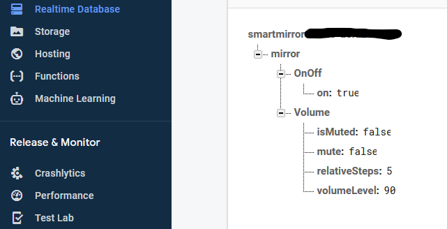

# MMM-DeviceControl 

The purpose of this repository is to communicate back and forth with a Firebase Realtime Database with read + write permissions. 

It will execute local commands to control the a Raspberry Pi 4, Debian Buster, volume + screensaver. 

Note: requies Firebase Token + Firebase node packages. 

## Setup

*Credentials*: Append the following to your **~/.bashrc**
``` js 
# <<< FIREBASE >>>
export FIREBASE_TOKEN="COPY AND PASTE TOKEN"
```

## Dependencies 
| Repository | Purpose |
| --- | --- |
| firebase-smarthome/ | Firebase Function + Testing user-interface
| [Magic Mirror](https://github.com/MichMich/MagicMirror) | MagicMirror User Interface
| [MMM-GoogleAssistant](https://github.com/jeffmur/MMM-GoogleAssistant) | Embedded Assistant api v2
| [MMM-ProfileSwitcher](https://github.com/jeffmur/MMM-ProfileSwitcher) | Google Pub/Sub subscriber for events

## Install + Integration
**Assuming Magic Mirror is already installed!**
```sh
cd ~/MagicMirror/modules
git clone https://github.com/jeffmur/MMM-DeviceControl
cd MMM-DeviceControl
npm install
```

## Run Time Tasks 
Reference Realtime Database image. 
| Daemon | Database Attribute |
| --- | --- |
| display_daemon() | OnOff.on state |
| volume_daemon() | Volume.volumeLevel state |
| mute_daemon() | Volume.isMuted state |



